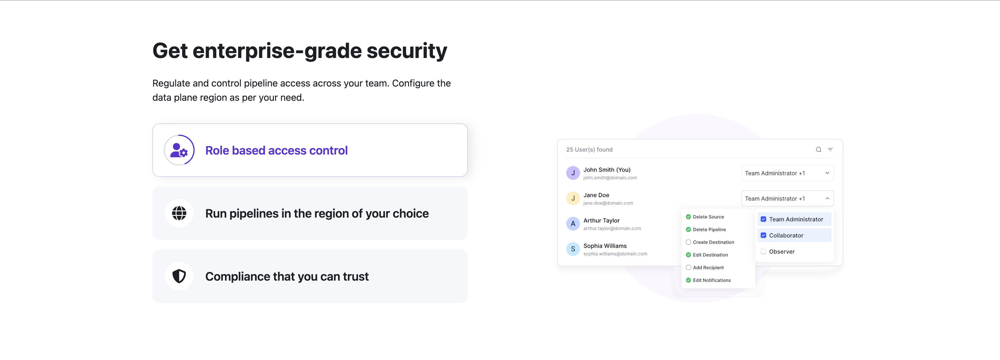

# Enterprise Security Feature Cards UI

Hi! 👋  
This is my take on the animated feature cards UI, as described in the assignment.  
The goal was to make it modular, responsive, accessible, and SEO-friendly.

---

## 🗂️ Folder Structure

Here's how I organized things:

```
src/
  ├── assets/                # SVGs and images for the UI
  ├── components/
  │     ├── Card.jsx         # Renders a single card (icon, title, progress)
  │     ├── CardList.jsx     # Maps over all cards, handles click logic
  │     └── ImagePanel.jsx   # Shows the right-side image
  ├── App.jsx                # Main app, manages state and layout
  └── App.css                # Custom styles (if needed)
```

---

## 🧩 Approach

- **Modularity:**  
  I split the UI into small components: `Card` for each feature, `CardList` for the group, and `ImagePanel` for the right-side image.  
  This way, if you want to add more cards or change the image logic, it's easy.

- **State Management:**  
  The main state (which card is active, progress, and autoplay) lives in `App.jsx`.  
  When the progress animation finishes, it moves to the next card. If you click a card, it stops the auto-advance.

- **Responsiveness:**  
  I used Tailwind for layout and typography. The left and right sides stay balanced on desktop, and stack nicely on mobile.

- **Design Tokens:**  
  I tried to match the provided colors and typography as closely as possible, using Tailwind's arbitrary values where needed.

---

## 🛠️ Accessibility & SEO Improvements

- **Accessible List Navigation:**  
  The feature cards are rendered as a semantic `<ul>` list, with each card as an `<li>`.  
  Each card is focusable with the keyboard (`tab`), and can be activated with `Enter` or `Space` (using `tabIndex={0}` and `role="button"` for accessibility).

- **Semantic Headings and Text:**  
  The section uses a proper heading (`<h1>`) for the title and a `<p>` for the supporting text, making the structure clear for both users and search engines.

- **Semantic List Markup:**  
  The cards are inside a `<ul>`, and each card is an `<li>`. This helps screen readers and search engines understand the content as a list of features.

---

## 🛠️ How it Works

- When the page loads, the first card animates with a circular progress bar.
- When the animation finishes, it moves to the next card, and the image on the right updates.
- If you click any card (or use keyboard navigation), it becomes active and the auto-loop stops.
- The cards and image are responsive, so it looks good on both desktop and mobile.

---

## 📝 Customizing

- **Want to add more cards?**  
  Just add to the `cards` array in `App.jsx`—the rest is automatic.
- **Change images?**  
  Drop new SVGs in `src/assets/` and update the array.
- **Tweak styles?**  
  Most of the look is handled by Tailwind classes, but you can add more in `App.css` if you want.

---

## 🤔 Why this approach?

I wanted to keep things simple and readable, but also show that I can structure a React project for real-world use.  
Splitting into components makes it easier to test, maintain, and extend.  
Using Tailwind keeps the CSS minimal and the design consistent.  
And with the accessibility and SEO improvements, the UI is friendly for both users and search engines.

---

## 🧰 Tech Stack

- React (functional components, hooks)
- Tailwind CSS (for layout and design)
- FontAwesome (for icons)

---

## 📸 Screenshots

### Desktop



### Mobile


---

If you have any questions or want to see a different approach, let me know!  
Thanks for reviewing my assignment 🙏
